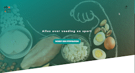

# Link to live demo 🖥

https://farrahton.github.io/obaVoeding/OBA/

If the data doesn't load you will need to visit https://cors-anywhere.herokuapp.com/corsdemo and request temporary access. 

</img>

# A table of contents 📚
1. [How to install](#installation)
2. [What are the features + concept](#features)
3. [A check- and wishlist](#checklist)

 

# How to install this project? 🤓 

1. Clone the repository with <a href="https://github.com/farrahton/obaVoeding.git">this link</a>

2. Copy in VSCode or your own prefered program 

3. Open with a live server and preferably with localhost, since it worked the best when there were issues with the API.

 

# What are its features + concept 🤔 

<i> <strong> User story: </strong>

Voeding en diëtiek
Als sportieve twintiger wil ik mij verdiepen in het effect van gezonde voeding op mijn conditie, om te leren hoe ik mijn sport beter kan beoefenen. </i>
 
 
On this website a person can find all the necessary information about food and fitness given by oba. The user can find events, books, audiobooks and more to get inspired and motivated. If given more time it would also have had more self-written content with fun (good to know) facts about food and how it can affect ones body in combination with working out. Moreover, it would have an introduction with a form that asks for the persons lifestyle, goals in food and fitness, and their learning style (visual, text, hearing, deep dive, summary etc.) to help them with the right recommendations from filtered data. Currently there are still some irrelevant recommendations and the state with the form is also not incorporated.

 

# A checklist of done stuff and stuff still on my wishlist ✅ 
- [x] calendar event
- [x] empty state for bookmarking events
- [x] fetch data
- [x] use multiple parameters
- [x] browse different types of content (book, audiobook)

- [ ] the form thingy introduction
- [ ] extra content with some fun facts
- [ ] filtered data
- [ ] detail page for books
- [ ] when you click on 'ik kom' it actually saves it to the empty bookmark

